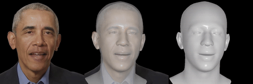
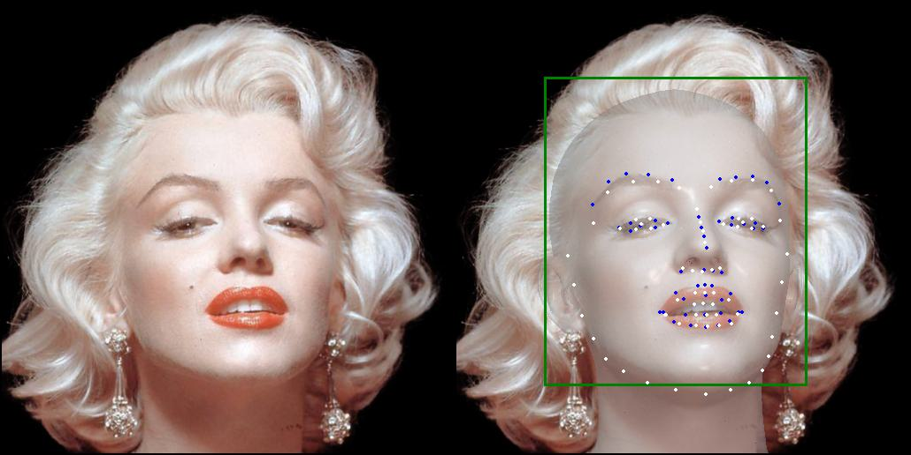

<h1 align="center"><b>⚡️ Tracking Framework for <a href="https://github.com/xg-chu/GAGAvatar">GAGAvatar</a> ⚡️</b></h1>
<h3 align="center">
    <a href='https://arxiv.org/abs/2410.07971'></a> &nbsp; 
    <a href='https://xg-chu.site/project_gagavatar/'></a> &nbsp; 
    <!-- <a href='https://www.youtube.com/watch?v=7A3DMaB6Zk0'></a> &nbsp;  -->
    <a href='https://github.com/xg-chu/GAGAvatar/'></a> &nbsp; 
</h3>

<div align="center"> 
    <b>🚀 Track video 🚀</b> 
    <div align="center"> 
        <b></b>
    </div>
</div>
<div align="center"> 
    <b>🚅 Track image 🚅</b>
    <div align="center"> 
        <b></b>
    </div>
</div>


## Description
**GAGAvatar Track** is a monocular face tracker built on FLAME. It provides FLAME parameters (including **eyeball pose**) and camera parameters, along with the bounding box and landmarks used during optimization.

## Installation
### Build environment
This environment is a sub-environment of **GAGAvatar**. You can skip this step if you have already built **GAGAvatar**.

```
conda env create -f environment.yml
conda activate GAGAvatar_track
```

### Prepare resources
Prepare resources with ```bash ./build_resources.sh```.

<details>
<summary><span>Resources Link</span></summary>

*The models and resources are available at https://huggingface.co/xg-chu/GAGAvatar_track.*
</details>


## Fast start
*It takes longer to track the first frame.*

#### Track on video(s):
```
python track_video.py -v ./demos/obama.mp4
```

#### Track on image(s):
```
python track_image.py -i ./demos/monroe.jpg
```
#### Track all images in a LMDB dataset:
```
python track_lmdb.py -l ./demos/vfhq_demo
```

## Citation
If you find our work useful in your research, please consider citing:
```bibtex
@inproceedings{
    chu2024gagavatar,
    title={Generalizable and Animatable Gaussian Head Avatar},
    author={Xuangeng Chu and Tatsuya Harada},
    booktitle={The Thirty-eighth Annual Conference on Neural Information Processing Systems},
    year={2024},
    url={https://openreview.net/forum?id=gVM2AZ5xA6}
}
```

## Acknowledgements
Some part of our work is built based on FLAME, StyleMatte, EMICA and VGGHead. 
The GAGAvatar Logo is designed by Caihong Ning.
We thank you for sharing their wonderful code and their wonderful work.
- **FLAME**: https://flame.is.tue.mpg.de
- **StyleMatte**: https://github.com/chroneus/stylematte
- **EMICA**: https://github.com/radekd91/inferno
- **VGGHead**: https://github.com/KupynOrest/head_detector
